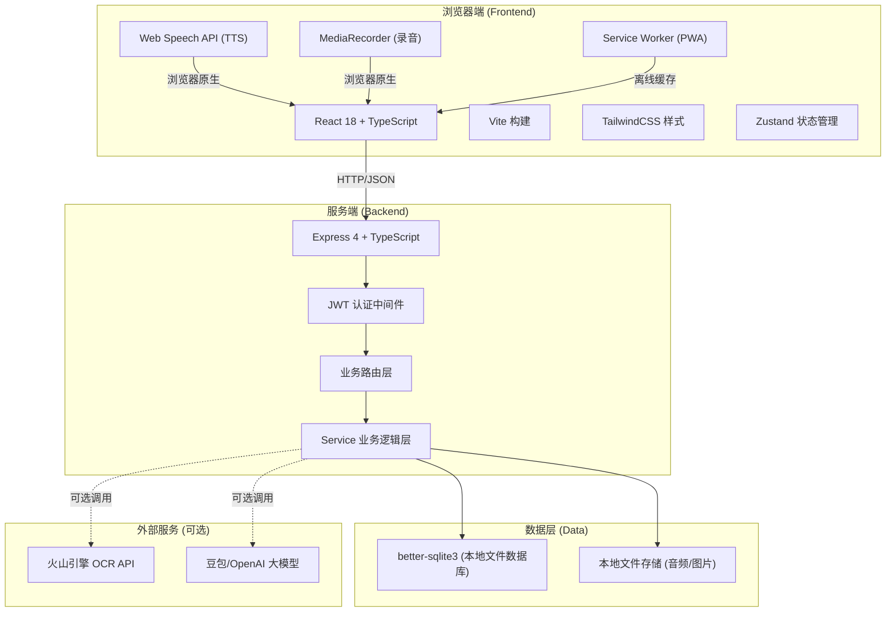
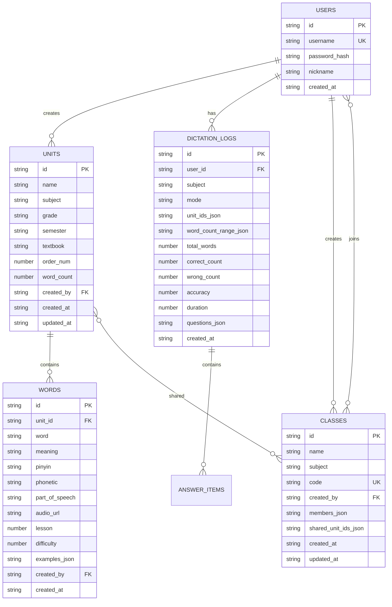

# 智听 · Homework Buddy Web 版 技术架构文档

## 1. 架构设计

Web 版采用前后端分离架构，前端 React SPA + 后端 Express API + SQLite 数据库，一键启动即可使用，彻底摆脱微信云开发依赖。



## 2. 技术说明

- **前端**：React 18 + TypeScript + Vite 5 + TailwindCSS 3 + Zustand + React Router 6
- **后端**：Express 4 + TypeScript + better-sqlite3（同步API、零配置、单文件数据库）
- **认证**：JWT (jsonwebtoken) + bcryptjs 密码哈希，支持游客模式（localStorage 持久化）
- **TTS语音**：Web Speech API（浏览器原生 `speechSynthesis`，免费、支持中英文），替代微信同声传译插件
- **录音**：MediaRecorder API（浏览器原生），替代 `wx.getRecorderManager`
- **OCR**：Tesseract.js（纯前端OCR，离线可用）+ 可选火山引擎云端OCR（更高准确率）
- **文件上传**：multer 中间件，本地文件系统存储
- **初始化工具**：vite-init（react-express-ts 模板）
- **包管理器**：npm
- **测试**：Vitest（前端单元测试）+ Jest/supertest（后端API测试）

### 微信小程序 → Web API 替代映射

| 微信小程序 API | Web 替代方案 | 说明 |
|---------------|-------------|------|
| wx.cloud.callFunction | fetch/axios → Express REST API | 前后端HTTP通信 |
| wx.cloud.database | better-sqlite3 | 本地关系型数据库，SQL查询 |
| wx.cloud.uploadFile | multer + fs | 本地文件上传存储 |
| wx.getRecorderManager | MediaRecorder API | 浏览器原生录音 |
| InnerAudioContext | HTMLAudioElement / Audio API | 音频播放 |
| WechatSI 同声传译 TTS | Web Speech API (speechSynthesis) | 浏览器原生语音合成 |
| wx.login / openid | JWT + 用户名密码/游客模式 | 标准Web认证 |
| wx.chooseMedia / wx.chooseImage | `<input type="file">` + File API | 文件选择 |
| wx.compressImage | Canvas API 压缩 | 前端图片压缩 |
| wx.showToast / wx.showModal | 自定义Toast/Modal组件 | React组件 |
| wx.vibrateShort | navigator.vibrate | 震动反馈（移动端） |
| eventChannel | React Router state / Zustand | 页面间大数据传递 |
| 云函数分页查询 | SQL LIMIT/OFFSET | 标准分页 |

## 3. 路由定义

### 前端路由
| 路由 | 页面 | 功能 |
|------|------|------|
| `/` | 首页 | 听写配置、快速开始、最近记录 |
| `/dictation` | 听写进行页 | 答题主界面 |
| `/result` | 结果页 | 成绩展示、错题列表 |
| `/units` | 单元管理 | 单元列表、创建/编辑 |
| `/units/:unitId/words` | 单词管理 | 单词列表、CRUD |
| `/class` | 班级中心 | 班级列表、创建/加入 |
| `/class/:classId` | 班级详情 | 成员、共享单元管理 |
| `/scan` | 拍照导入 | OCR上传、结果预览 |
| `/preset` | 预置词库 | 教材筛选、导入 |
| `/profile` | 个人中心 | 历史记录、统计、设置 |
| `/login` | 登录/注册 | 用户认证 |

### 后端 API 路由
| 方法 | 路径 | 功能 | 认证 |
|------|------|------|------|
| POST | `/api/auth/register` | 用户注册 | 否 |
| POST | `/api/auth/login` | 用户登录 | 否 |
| GET | `/api/auth/me` | 获取当前用户 | 是 |
| GET | `/api/units` | 获取单元列表（我的+共享） | 是 |
| POST | `/api/units` | 创建单元 | 是 |
| PUT | `/api/units/:id` | 更新单元 | 是 |
| DELETE | `/api/units/:id` | 删除单元（级联单词） | 是 |
| GET | `/api/units/:id/words` | 获取单元单词列表 | 是 |
| POST | `/api/words` | 创建单词 | 是 |
| PUT | `/api/words/:id` | 更新单词 | 是 |
| DELETE | `/api/words/:id` | 删除单词 | 是 |
| POST | `/api/words/batch` | 批量导入单词 | 是 |
| POST | `/api/dictation/start` | 获取听写题目列表 | 是 |
| POST | `/api/dictation/submit` | 提交听写结果保存记录 | 是 |
| GET | `/api/logs` | 获取听写历史记录 | 是 |
| GET | `/api/logs/:id` | 获取单条记录详情 | 是 |
| DELETE | `/api/logs/:id` | 删除历史记录 | 是 |
| POST | `/api/classes` | 创建班级 | 是 |
| POST | `/api/classes/join` | 加入班级（6位码） | 是 |
| GET | `/api/classes` | 我的班级列表 | 是 |
| GET | `/api/classes/:id` | 班级详情 | 是 |
| POST | `/api/classes/:id/share` | 共享单元到班级 | 是 |
| POST | `/api/classes/:id/unshare` | 取消共享单元 | 是 |
| POST | `/api/classes/:id/leave` | 退出班级 | 是 |
| DELETE | `/api/classes/:id` | 解散班级 | 是 |
| POST | `/api/ocr/parse` | OCR图片解析（上传图片） | 是 |
| GET | `/api/preset/filters` | 预置内容筛选选项 | 否 |
| GET | `/api/preset/textbooks` | 预置教材列表 | 否 |
| GET | `/api/preset/units` | 预置单元列表 | 否 |
| GET | `/api/preset/units/:id/words` | 预置单元单词预览 | 否 |
| POST | `/api/preset/import` | 导入预置单元到我的词库 | 是 |
| POST | `/api/upload/audio` | 上传自定义录音 | 是 |

## 4. API 类型定义

```typescript
// 通用响应格式
interface ApiResponse<T = any> {
  code: number      // 0=成功, 1=未知操作, 2=参数错误, 3=不存在, 4=未找到, 5=无权限, -1=服务错误
  message: string
  data?: T
}

// 用户
interface User {
  id: string
  username: string
  nickname?: string
  createdAt: string
}

// 单元
interface Unit {
  id: string
  name: string
  subject: 'english' | 'chinese'
  grade?: string
  semester?: string
  textbook?: string
  order: number
  wordCount: number
  createdAt: string
  updatedAt: string
  createdBy: string
  isShared?: boolean
}

// 单词
interface Word {
  id: string
  unitId: string
  word: string
  meaning: string
  pinyin?: string
  phonetic?: string
  partOfSpeech?: string
  audioUrl?: string
  lesson?: number
  difficulty: number
  examples: string[]
  createdAt: string
}

// 听写题目
interface Question {
  index: number
  wordId: string
  unitId: string
  word: string
  meaning: string
  pinyin?: string
  subject: 'english' | 'chinese'
  mode: 'en2cn' | 'cn2en' | 'pinyin2hanzi' | 'hanzi2pinyin'
  prompt: string
  promptType: 'english' | 'chinese' | 'pinyin'
  answer: string
  answerType: 'english' | 'chinese' | 'pinyin'
  audioUrl?: string
}

// 听写结果答案
interface AnswerItem {
  wordId: string
  word: string
  meaning: string
  pinyin?: string
  mode: string
  prompt: string
  correctAnswer: string
  userAnswer: string
  isCorrect: boolean
}

// 听写记录
interface DictationLog {
  id: string
  userId: string
  subject: 'english' | 'chinese'
  mode: string
  unitIds: string[]
  unitNames?: string[]
  wordCountRange: { min: number; max: number }
  lessonRange?: { min: number; max: number }
  totalWords: number
  correctCount: number
  wrongCount: number
  accuracy: number
  duration: number
  questions: AnswerItem[]
  wrongWords: AnswerItem[]
  createdAt: string
}

// 班级
interface ClassInfo {
  id: string
  name: string
  subject: 'english' | 'chinese'
  code: string          // 6位邀请码
  createdBy: string
  creatorName?: string
  members: string[]
  memberCount: number
  sharedUnitIds: string[]
  sharedUnits?: Unit[]
  isCreator: boolean
  createdAt: string
}
```

## 5. 服务端架构

```mermaid
flowchart LR
    "HTTP Request" --> "Express App"
    "Express App" --> "CORS / JSON Body Parser"
    "CORS / JSON Body Parser" --> "Auth Middleware (JWT)"
    "Auth Middleware (JWT)" --> "Router (units/words/classes/etc)"
    "Router (units/words/classes/etc)" --> "Service Layer"
    "Service Layer" --> "Database (better-sqlite3)"
    "Service Layer" --> "File System (uploads)"
    "Service Layer" -->|"可选"| "External APIs (OCR/LLM)"
```

后端目录结构：
```
api/
├── src/
│   ├── index.ts              # Express 入口
│   ├── middleware/
│   │   └── auth.ts           # JWT 认证中间件
│   ├── routes/
│   │   ├── auth.ts
│   │   ├── units.ts
│   │   ├── words.ts
│   │   ├── dictation.ts
│   │   ├── logs.ts
│   │   ├── classes.ts
│   │   ├── ocr.ts
│   │   ├── preset.ts
│   │   └── upload.ts
│   ├── services/
│   │   ├── unitService.ts
│   │   ├── wordService.ts
│   │   ├── dictationService.ts
│   │   ├── logService.ts
│   │   ├── classService.ts
│   │   ├── ocrService.ts
│   │   └── presetService.ts
│   ├── db/
│   │   ├── index.ts          # 数据库初始化、连接
│   │   ├── migrations/       # 建表SQL、种子数据
│   │   └── seed.ts           # 预置教材/单元数据
│   └── utils/
│       ├── response.ts       # 统一响应格式
│       ├── pagination.ts     # 分页工具
│       └── codeGenerator.ts  # 班级码生成
└── package.json
```

## 6. 数据模型

### 6.1 ER 图



### 6.2 DDL (SQLite)

```sql
-- 用户表
CREATE TABLE IF NOT EXISTS users (
  id TEXT PRIMARY KEY,
  username TEXT UNIQUE NOT NULL,
  password_hash TEXT NOT NULL,
  nickname TEXT,
  created_at TEXT NOT NULL DEFAULT (datetime('now'))
);

-- 单元表
CREATE TABLE IF NOT EXISTS units (
  id TEXT PRIMARY KEY,
  name TEXT NOT NULL,
  subject TEXT NOT NULL CHECK(subject IN ('english','chinese')),
  grade TEXT DEFAULT '',
  semester TEXT DEFAULT '',
  textbook TEXT DEFAULT '',
  order_num INTEGER DEFAULT 0,
  word_count INTEGER DEFAULT 0,
  created_by TEXT NOT NULL,
  created_at TEXT NOT NULL DEFAULT (datetime('now')),
  updated_at TEXT NOT NULL DEFAULT (datetime('now'))
);
CREATE INDEX IF NOT EXISTS idx_units_creator ON units(created_by);
CREATE INDEX IF NOT EXISTS idx_units_subject ON units(subject);

-- 单词表
CREATE TABLE IF NOT EXISTS words (
  id TEXT PRIMARY KEY,
  unit_id TEXT NOT NULL,
  word TEXT NOT NULL,
  meaning TEXT NOT NULL,
  pinyin TEXT DEFAULT '',
  phonetic TEXT DEFAULT '',
  part_of_speech TEXT DEFAULT '',
  audio_url TEXT DEFAULT '',
  lesson INTEGER DEFAULT 1,
  difficulty INTEGER DEFAULT 3,
  examples TEXT DEFAULT '[]',
  created_by TEXT NOT NULL,
  created_at TEXT NOT NULL DEFAULT (datetime('now')),
  FOREIGN KEY (unit_id) REFERENCES units(id) ON DELETE CASCADE
);
CREATE INDEX IF NOT EXISTS idx_words_unit ON words(unit_id);
CREATE INDEX IF NOT EXISTS idx_words_unit_word ON words(unit_id, word);

-- 班级表（members/shared_unit_ids 使用 JSON 数组存储）
CREATE TABLE IF NOT EXISTS classes (
  id TEXT PRIMARY KEY,
  name TEXT NOT NULL,
  subject TEXT NOT NULL CHECK(subject IN ('english','chinese')),
  code TEXT UNIQUE NOT NULL,
  created_by TEXT NOT NULL,
  members TEXT NOT NULL DEFAULT '[]',
  shared_unit_ids TEXT NOT NULL DEFAULT '[]',
  created_at TEXT NOT NULL DEFAULT (datetime('now')),
  updated_at TEXT NOT NULL DEFAULT (datetime('now'))
);
CREATE INDEX IF NOT EXISTS idx_classes_code ON classes(code);
CREATE INDEX IF NOT EXISTS idx_classes_creator ON classes(created_by);

-- 听写记录表（questions/wrong_words 存储 JSON）
CREATE TABLE IF NOT EXISTS dictation_logs (
  id TEXT PRIMARY KEY,
  user_id TEXT NOT NULL,
  subject TEXT NOT NULL,
  mode TEXT NOT NULL,
  unit_ids TEXT NOT NULL DEFAULT '[]',
  unit_names TEXT NOT NULL DEFAULT '[]',
  word_count_range TEXT NOT NULL DEFAULT '{}',
  lesson_range TEXT DEFAULT '{}',
  total_words INTEGER NOT NULL,
  correct_count INTEGER NOT NULL,
  wrong_count INTEGER NOT NULL,
  accuracy REAL NOT NULL,
  duration INTEGER NOT NULL DEFAULT 0,
  questions TEXT NOT NULL DEFAULT '[]',
  wrong_words TEXT NOT NULL DEFAULT '[]',
  created_at TEXT NOT NULL DEFAULT (datetime('now')),
  FOREIGN KEY (user_id) REFERENCES users(id) ON DELETE CASCADE
);
CREATE INDEX IF NOT EXISTS idx_logs_user ON dictation_logs(user_id);
CREATE INDEX IF NOT EXISTS idx_logs_created ON dictation_logs(created_at DESC);

-- 预置教材表（系统内置，不可用户修改）
CREATE TABLE IF NOT EXISTS preset_textbooks (
  id TEXT PRIMARY KEY,
  grade_level TEXT NOT NULL,
  subject TEXT NOT NULL,
  version TEXT NOT NULL,
  name TEXT NOT NULL,
  cover_url TEXT DEFAULT '',
  created_at TEXT NOT NULL DEFAULT (datetime('now'))
);

CREATE TABLE IF NOT EXISTS preset_units (
  id TEXT PRIMARY KEY,
  textbook_id TEXT NOT NULL,
  name TEXT NOT NULL,
  content_type TEXT DEFAULT 'word',
  order_num INTEGER DEFAULT 0,
  word_count INTEGER DEFAULT 0,
  FOREIGN KEY (textbook_id) REFERENCES preset_textbooks(id) ON DELETE CASCADE
);
CREATE INDEX IF NOT EXISTS idx_preset_units_textbook ON preset_units(textbook_id);

CREATE TABLE IF NOT EXISTS preset_words (
  id TEXT PRIMARY KEY,
  unit_id TEXT NOT NULL,
  word TEXT NOT NULL,
  meaning TEXT NOT NULL,
  pinyin TEXT DEFAULT '',
  phonetic TEXT DEFAULT '',
  audio_url TEXT DEFAULT '',
  lesson INTEGER DEFAULT 1,
  FOREIGN KEY (unit_id) REFERENCES preset_units(id) ON DELETE CASCADE
);
CREATE INDEX IF NOT EXISTS idx_preset_words_unit ON preset_words(unit_id);
```

## 7. 前端目录结构

```
src/
├── main.tsx                  # React 入口
├── App.tsx                   # 路由配置
├── index.css                 # Tailwind + 全局样式
├── components/
│   ├── layout/
│   │   ├── Navbar.tsx        # 顶部导航栏
│   │   ├── BottomTab.tsx     # 移动端底部Tab
│   │   └── Container.tsx     # 页面容器
│   ├── ui/
│   │   ├── Button.tsx
│   │   ├── Input.tsx
│   │   ├── Card.tsx
│   │   ├── Modal.tsx
│   │   ├── Toast.tsx
│   │   └── Select.tsx
│   ├── dictation/
│   │   ├── QuestionDisplay.tsx
│   │   ├── AnswerInput.tsx
│   │   ├── ProgressBar.tsx
│   │   └── ResultChart.tsx
│   └── common/
│       ├── SubjectSwitch.tsx
│       ├── ModeCard.tsx
│       ├── UnitCard.tsx
│       └── WordRow.tsx
├── pages/
│   ├── Home.tsx
│   ├── Dictation.tsx
│   ├── Result.tsx
│   ├── Units.tsx
│   ├── Words.tsx
│   ├── Classes.tsx
│   ├── ClassDetail.tsx
│   ├── Scan.tsx
│   ├── Preset.tsx
│   ├── Profile.tsx
│   └── Login.tsx
├── hooks/
│   ├── useAuth.ts
│   ├── useTTS.ts             # Web Speech API 封装
│   ├── useAudioRecorder.ts   # MediaRecorder 封装
│   └── useApi.ts
├── stores/
│   ├── useAuthStore.ts
│   ├── useDictationStore.ts
│   └── useUIStore.ts
├── utils/
│   ├── api.ts                # axios 封装
│   ├── constants.ts          # 常量定义（与后端一致）
│   └── helpers.ts
└── types/
    └── index.ts              # TypeScript 类型定义
```

## 8. 部署方案

### 开发环境
- 前端 Vite dev server：`http://localhost:5173`
- 后端 Express API：`http://localhost:3000`
- Vite 配置 proxy 将 `/api` 请求代理到后端

### 生产部署（多种方案可选）
1. **一体化部署**（推荐新手）：前端构建后作为静态资源由 Express 托管，单端口（3000）对外服务
2. **分离部署**：前端部署到 Nginx/CDN，后端独立部署
3. **Docker**：提供 Dockerfile，一键容器化部署

### 数据持久化
- SQLite 数据库文件：`./data/app.db`
- 上传音频/图片：`./uploads/`
- 这两个目录需要在部署时挂载为持久化卷
